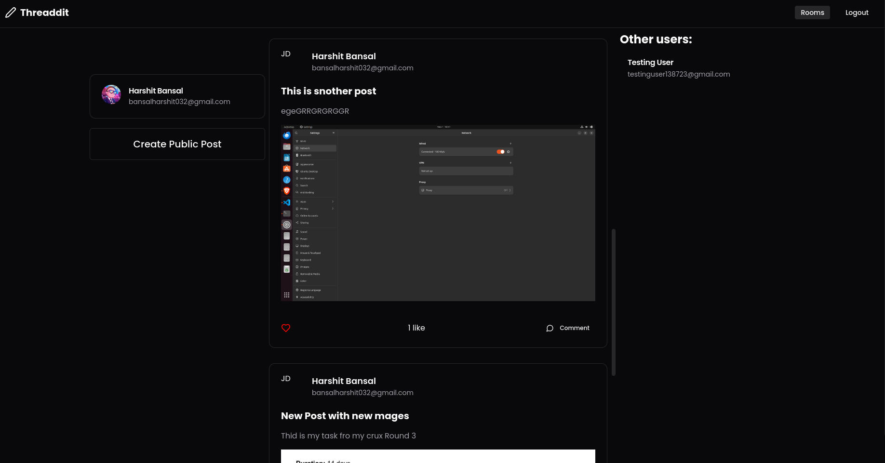
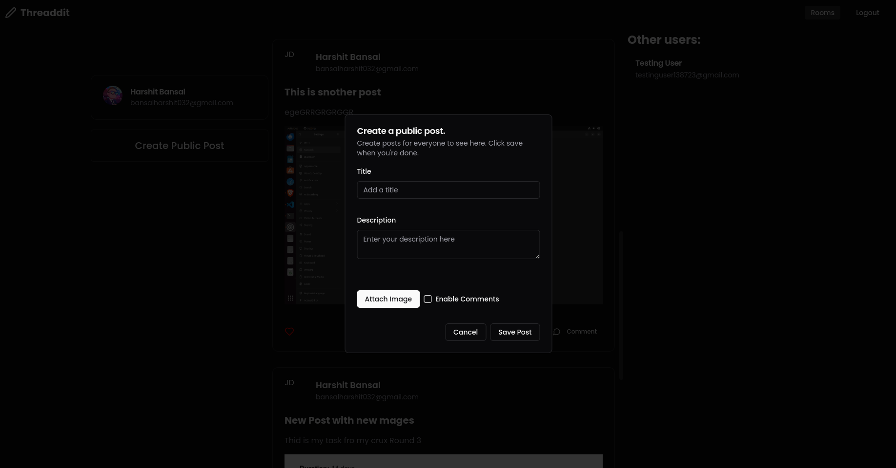
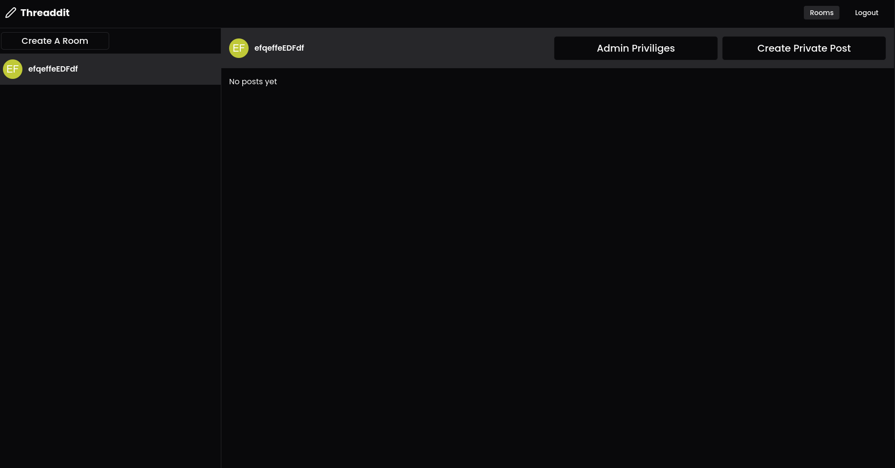

# Threaddit

A Threads/Reddit clone made using React in Typescript.Create POsts publicly or in private room and chat with your friends!.

How it works:

-   Login using Google

-   Navigate to the home where you will be able to see other users posts on your feed.



-   Create a post of your own!.



-   Navigate to the rooms page and and creat private room!



## Made Using:

-   Typescript

-   Express/NodeJs

-   Postgres

-   Docker

# Set Up:

-   cd to the client/threaddit and server folders and run npm i

-   cd to the server folder and install docker

-   set up a .env file in the server folder as such

```js
DB_HOST = db;
DB_DB = postgres;
DB_PORT = 5432;
DB_PASSWORD = postgres;
DB_USER = postgres;

REDIS_HOST = redis;
REDIS_PORT = 6379;

GOOGLE_CLIENT_ID = "";
GOOGLE_CLIENT_SECRET = "";

JWT_SECRET = "dfknefklnfk";

UI_ROOT_URL = "http://localhost:5173";
```

-   run sudo docker-compose up

-   navigate to client/threaddit and run: npm run dev
=======

